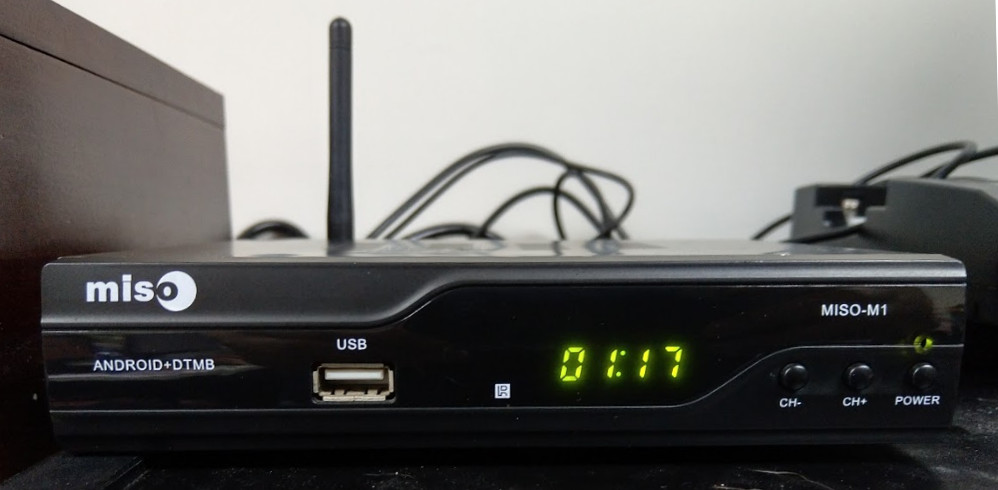
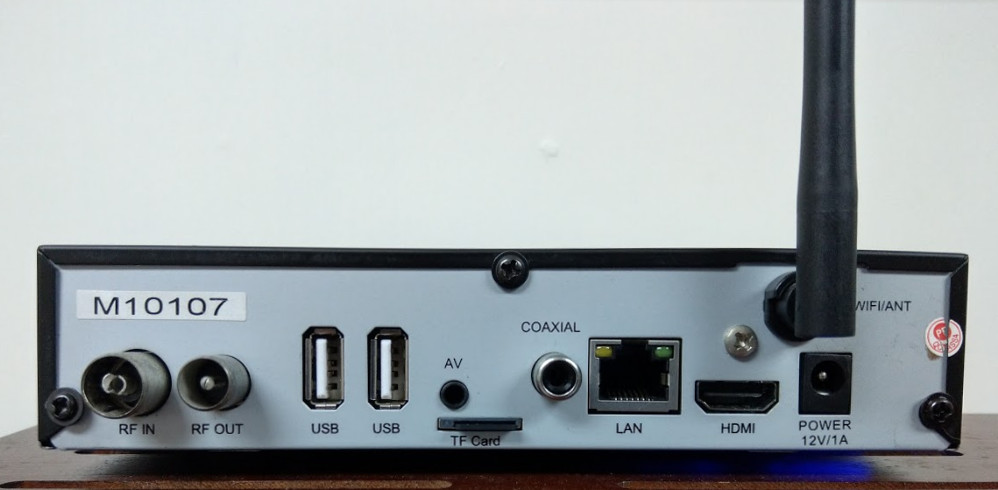
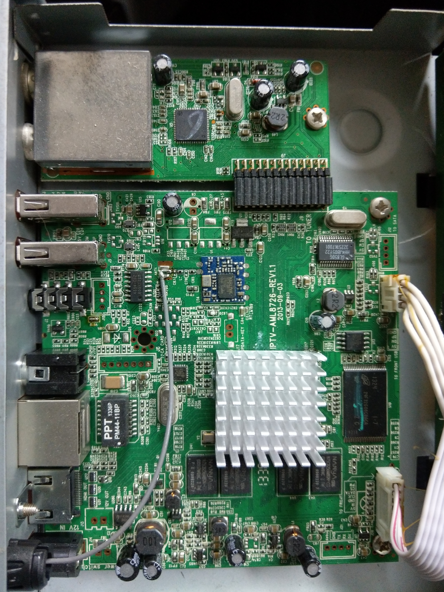

## platform-aml (g02ref)

Platform files for building Volumio for Amlogic g02ref devices with AML8726-MX (Meson6) SOC.

These devices were released back in around 2013, mostly as rebranded Android TV set-top boxes. The reference design supports coaxial digital audio out, which makes these otherwise-obsolete devices suitable for running Volumio (but read Known Issues).

Also commonly found on these boxes is a 4-digit VFD display which can be used to display the clock or time elapsed when Volumio is playing. The VFD service is enabled in the g02ref Volumio builds. You can find the sources [here](https://github.com/patrickkfkan/tm1628mpd "here").

The unit tested is a Miso-M1:





Other g02ref devices more or less share the same design and features.

### Building Volumio for g02ref

You should do this on Debian Jessie (perhaps in a VM). You may have read that you can build Volumio on other platforms like Ubuntu but the truth is building on Debian Jessie is the easiest.

Make sure you have the required packages installed (read Volumio official documentation), then:
```sh
> git clone https://github.com/patrickkfkan/volumio-build
> cd volumio-build
> ./build.sh -b armv7 -d amlg02ref -v 2.657
```

Image will be created, which you can then burn to MicroSD and boot Volumio on your g02ref device.

If you want to compile the kernel yourself, you can find instructions in `How to compile the Amlogic g02ref kernel.txt`

Note that g02ref devices commonly have a DVB tuner attached for receiving digital TV broadcasts. For the purpose of running Volumio, however, the DVB drivers have been left out from the kernel to keep its footprint small.

### Booting Volumio on g02ref devices

Some g02ref devices have a switch hidden behind the AV port and can be set to boot from MicroSD using the "toothpick" method. After inserting the MicroSD card (with Volumio on it), you insert a toothpick into the AV port until you feel it pressing against the switch. Then, without taking out the toothpick, you connect the device to the power supply and wait for the device to boot from the MicroSD card. You can take the toothpick out after a while when you don't see the normal splash screen (which means the device is booting from the MicroSD).

On other g02ref devices, such as the Miso-M1 test unit, there is no switch behind the AV port. Instead you would have to long-press the power button. You might not succeed on first try and boot into Android, in which case you would long-press the power button until the device shuts down (green LED turns red), and long-press the power button again.

On first boot, Volumio might take a while to initialize. Please allow 5-10 minutes for this process, during which nothing will be shown on screen. After successful initialization, you will presented with the login prompt and VFD will show the time (which could be incorrect - you would have to run `dpkg-reconfigure tzdata` to configure).

Note that you don't have to connect a screen to the device at all. Volumio will run fine without HDMI connected.

### Known issues

##### Resampling

Resampling to a different sample rate will cause crackling noises and stutters of all sorts. Kernel messages will show a bunch of "audio data unaligned" errors which comes down to the Amlogic m6 PCM driver being buggy or incompatible with how Volumio / MPD sends audio data to the driver.

This applies to audio sent through HDMI and coax. If you use a USB sound card, you can resample without problem.

It is worth noting that LibreELEC / Kodi's audio engine does have a workaround for this issue, however it has not been implemented within Volumio / MPD.

##### Audio at 88.2khz, 176.4khz and anything above 192khz

At these sample rates, you get either noise or audio plays super slow. Unfortunately, resampling doesn't work as aforementioned (unless you use USB sound card), so... *shrug*

##### Volume control

Hardware volume control is only possible at 16-bit playback. Volume is maxed out at other bit-depths. Fortunately, you can resample to 16-bit as long as you don't change the sample rate. Therefore, in Volumio, under Playback Options -> Audio Resampling, you can choose the following values to get volume control working when playing audio files of different bit-depths:

- Target Bit Depth: 16-bit
- Target Sample Rate: Native
- Resampling Algorithm Quality: any value

*Do not use Software Volume Control - it will somehow freeze Volumio!*

Again, this issue does not apply to USB sound cards.

##### ALSA state

ALSA saves the sound card state when Volumio shuts down, through the `alsa-store` systemd service. Possibly due to another bug in Amlogic's sound driver, this will actually crash the system (Kernel null pointer deference). To work around this, `alsa-store` has been disabled (masked) but you will lose your volume settings, i.e. you will have to set the volume again next time you start Volumio.

##### (Very) slight pause between tracks

The "audio data unaligned" issue mentioned above could show up when Volumio advances to another track in the playlist - that is even without resampling. To work around this, a pause is given between tracks. You can read more in the comments in `/usr/local/bin/mpd-pause-btw-tracks.sh`

Although the pause is very short, you may still notice it if your audio files have gapless playback or when you choose to fade between tracks.

Note that there will be no pause for web radio. Also, if you are using USB audio, you may disable this by entering the following once in the console:

```sh
volumio@volumio:~$ systemctl disable mpd-pause-btw-tracks
```


